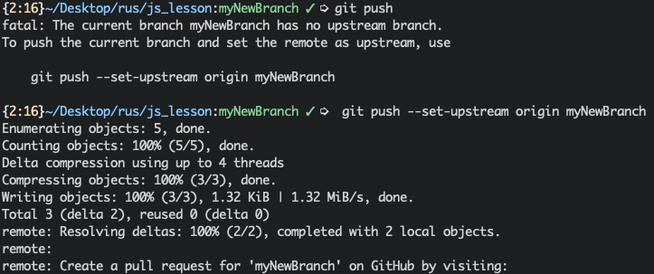

<h1 align="center">💰BudgetHelper💰<h1>

 

<h2>Table of Content</h2>
<ul>
<li><a href='#general'>General info</a></li>
<li><a href='#dependencies'>Dependencies</a></li>
<li><a href='#setup'>Project setup</a></li>
<li><a href='#contribution'>Contribution</a></li>
</ul>

 

<h2>General info 💡<h3>

This application was created in order to make visualization of the personal budget control. The application allows you to track user's fixed incomes and expenses, to plan financial goals and to display a report for a selected period of time. The main motto is to create a lightweight and UX-friendly app using React for UI rendering and Firebase for data storage. The project was originally created, designed and developed as part of the frontend development course in JavaGuru.

 

<h2>Dependencies 🛠<h3>
<code>
├── date-fns@1.30.1  
├── react@16.8.6  
├── react-dom@16.8.6  
├── react-icons@3.7.0  
└── styled-components@4.3.1  
</code>

 

<h2>Setup 🔌<h3>

Steps to run app localy:

<ul>
<li>

 Clone repo to your directory:

<code>
cd [project directory] 
git clone
</code>
</li>
<li>

 After repository is cloned install dependencies with yarn on npm

<code> yarn </code> or <code>npm install</code>
</li>
<li>

 After all You are ready to go! To start app localy:

<code> yarn start </code> or <code>npm start</code>
</li>
<li>

 To build project:

<code> yarn build </code> or <code>npm run build</code>
</li>
</ul>

 

<h2>Contribution 💎<h3>

🚨Warning🚨 
Generally this section is for our team collaborators.

If you want to contribute to this project you need to make your Pull Request. Here is short guide for you:

<h4>Fork repository and clone it</h4>

To start your contribution you need to fork this repo to your github profile and then clone it and intall all dependencies. 

<h4>Create new branch</h4>

First of all before development you need to make separate branch locally:

<code> git checkout -b [your branch name] </code>

<h4>Develop and commit your changes</h4>

After you've created new branch you can proceed your development. When you're finish you need to commit your changes:

<code> git status</code> 

check status before commit

<code> git add .</code> 

to add all changes for commit or

<code> git add [filename]</code> 

to add exact file. Then you need to make commit of your changes

<code> git commit -m "[commit message]"</code> 

Now you can push your commit to remote repository

<code> git push --set-upstream origin [your branch name]</code> 
<h4>Make your Pull Request</h4>

Since your commits are pushed to your forked repo you can make your pull request

First you need to select your branch in your forked repo

Then chose "Pull request" section

Press "Compare & Pull request" button. After you button is pressed you need to compose your pull request.Choose your target repo in "base repository" select and your forked repository and branch in "head repository" select 

<h4>Finish</h4>

Congrats! You made it! Now wait for your PR merge. When everything will be confirmed you can pull forked repository with applied PR and remove your branches (locally and remote) : 

<code> 
git pull
</code>

to remove branch locally:

<code> 
git branch -d [branch_name]
</code>

to remove branch remote:

<code> 
git push origin --delete [branch_name]
</code>

 Good luck in your contributions! 😎 

 